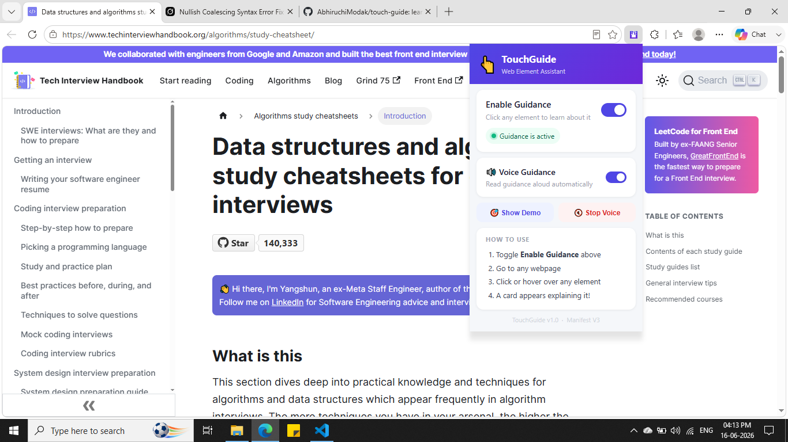
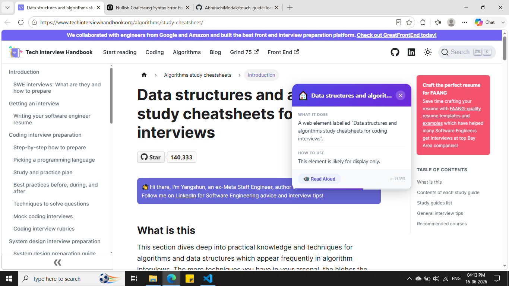

# touch-guide
learn about any web element by clicking on it with this browser extension

# TouchGuide — Web Element Assistant

A helpful browser extension that explains **any element** on a webpage when you click it.

Perfect for:
- Students learning web design
- Seniors or new internet users
- People with visual impairments
- Developers exploring unfamiliar websites

## Features

- Click or long-press any element to get instant explanation
- Voice narration (Text-to-Speech)
- AI-powered icon recognition fallback
- Beautiful floating guidance card
- Works on **any website**

## How to Install

1. Download the latest release
2. Go to `chrome://extensions/`
3. Enable **Developer mode**
4. Click **"Load unpacked"** and select the extension folder

## Screenshots

## Tech Stack

- Manifest V3
- Pure JavaScript + Shadow DOM
- Chrome TTS API
- No backend / privacy-friendly

